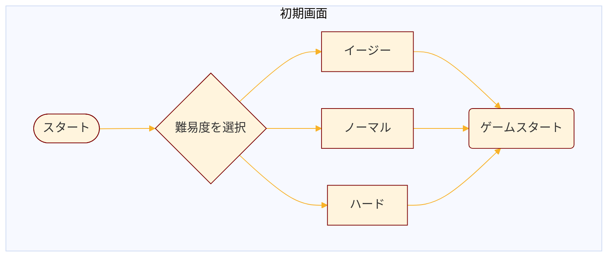
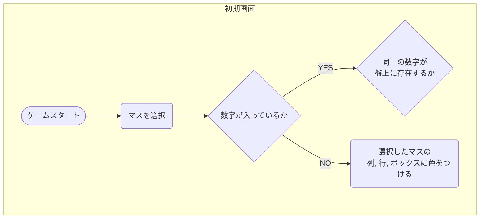

```mermaid
%%{init:{
    'theme':'base',
    'themeVariables': {
      'primaryBorderColor': '#7C0000',
      'lineColor': '#F8B229'
    }
  }
}%%
flowchart TD
  subgraph 初期画面
    A([スタート]) -->B{難易度を選択}
    B --> C[イージー]
    B --> D[ノーマル]
    B --> E[ハード]
    C --> F(ゲームスタート)
    D --> F(ゲームスタート)
    E --> F(ゲームスタート)   
  end 
```

```mermaid    
flowchart TD
  subgraph 初期画面
    A(["ゲームスタート"]) --> B("マスを選択")
    B --> C{"数字が入っているか"}
    C -->|YES| D{"同一の数字が
    盤上に存在するか"}
    C -->|NO| E("選択したマスの
    列, 行, ボックスに色をつける")
  end    
```